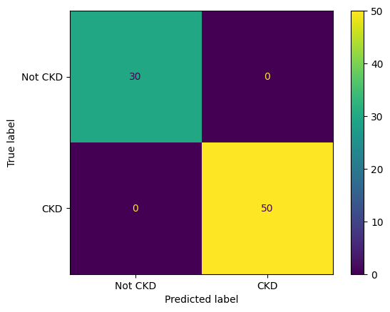
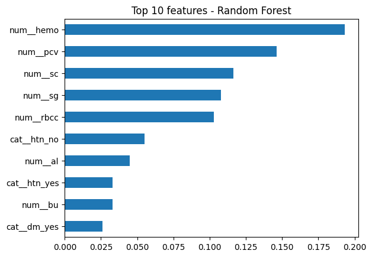

# # Chronic Kidney Disease Classification from Blood and Urine Markers

Exploratory Python project applying machine learning to routine laboratory
and clinical markers to distinguish CKD from non-CKD patients.

## Dataset
UCI Chronic Kidney Disease Dataset - 400 patients, 24 clinical and
laboratory variables (e.g. serum creatinine, blood urea, haemoglobin,
urine albumin). 250 patients have CKD (62.5%), 150 do not (37.5%).
https://archive.ics.uci.edu/dataset/336/chronic+kidney+disease

## Method
- Cleaned the data: converted placeholder values to missing, corrected data types.
- Split 80/20 into training and test sets, stratified to keep the class ratio
  identical in both, so the test set fairly reflects the full data.
- Built a preprocessing pipeline (median imputation and scaling for numeric
  features, most-frequent imputation and one-hot encoding for categorical
  features), fitted on training data only to avoid leakage.
- Compared logistic regression and a random forest with 5-fold
  cross-validation, prioritising recall because missing a true CKD case is
  the costlier error.

## Results
- Cross-validated: Logistic Regression - recall 0.99, precision 0.995,
  ROC AUC ~1.0. Random Forest - recall 0.995, precision 0.985, ROC AUC 1.0.
- Final test (random forest, 80 held-out patients): all 80 classified
  correctly (30/30 Not CKD, 50/50 CKD).
- Most influential features: haemoglobin, packed cell volume, serum
  creatinine, urine specific gravity, red blood cell count.

## Interpretation
Three of the top five features (haemoglobin, PCV, RBC count) reflect
anaemia, healthy kidneys produce erythropoietin, which stimulates red
cell production, and this falls in CKD. Creatinine rises as filtration
declines, and reduced urine specific gravity reflects the kidney's lost
ability to concentrate urine. Feature importance shows association, not
causation.

## Limitations
- Small dataset (400 patients) from a single source, no external validation.
- Missingness ranged from under 1% to 38% by column; filled using
  median/mode imputation fitted on training data only.
- CKD is over-represented relative to the general population, so
  performance would differ in a screening setting.
- Some extreme creatinine values may reflect severe disease or data-entry
  error, not distinguishable from this dataset alone.
- Exploratory model, not a diagnostic tool.

## Tools
Python, pandas, NumPy, scikit-learn, Matplotlib, Seaborn (Google Colab)

## Files
- `Chronic_Kidney_Disease_Classifier.ipynb` — full analysis notebook
